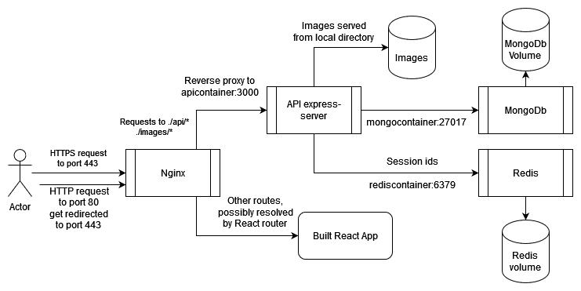

# README <!-- omit in toc -->

Wesail is a web application created as a project for the "fullstackopen" course. It is a social media application for logging planning and sharing sail trips and boat maintenance.

- [Running the application](#running-the-application)
- [Testing](#testing)
- [Architecture](#architecture)
  - [Folder architecture](#folder-architecture)
- [Worklog](#worklog)
- [Reflection](#reflection)

## Running the application

Running the application requires that the user has docker installed and running. The root directory has three docker compose files:

1. The [docker-compose.local.yml](./docker-compose.local.yml) can be used with docker compose to run the app locally (command: `docker compose -f docker-compose.local.yml up -d`), this will launch the app at http://localhost:3001. When running localy nginx uses a separate conf file compared to the production version.
2. [docker-compose.yml](./docker-compose.yml) is intended for production, it has https enabled and nginx won't work without adding a SSL certificate and key into the [./backend/ssl](./backend/ssl) directory. It can be run with docker compose with the command `docker compose up -d`.
3. [docker-compose.localstack.yml](./docker-compose.localstack.yml) can be used to run the application in swarm mode. When running Docker in swarm mode, it has to be first activated with `docker swarm init` to create a single-node swarm on the current node. One can check if the docker daemon is running in swarm mode with the `docker info` command and checking the value for the key 'swarm'. n.b. The sphepherd container used for automatic updates works only on computers with a UNIX-like filesystem but the application will launch even if spherpherd does not work. For more information about docker swarm please see the docker swarm's [official documentation](https://docs.docker.com/engine/swarm/swarm-mode/) and especially the part about [stack deploy](https://docs.docker.com/engine/swarm/stack-deploy/).

When launching the app for the first time the database is initialized according to the [dev-mongo-init.js](./backend/mongo/dev-mongo-init.js) file located in ./backend/mongo/ directory. It initializes the db with a default user which can be used to login right away (username: test, password: salasana).

After logging in there are already quit a lot of things a user can do. I have written a short [getting started guide](./documentation/getting_started.md). In addition, the main functionalities in the app are listed in the [requirement specification](./documentation/requirements_specification.md). Please notice that the location tracking in /logging with PCs is quite laggy and not yet fully functional. The initial point was to also make a react native version of the application, but this is yet to be implemented. In addition the location trackig does not yet save the route anywhere.

## Testing

Backend unit tests can be run with the command `npm run test` while in the ./backend directory. The same works for frontend unit tests in the ./frontend directory. Linting can be done by running the command `npm run lint`.

Cypress has been mainly used to run tests in development. Therefore , when running E2E tests with cypress, cypress assumes the app to be running on localhost:3000, and it assumes mongodb to be available via port 27000, and Redis via 6379. Redis and mongodb can be run with a docker compose file in backend [docker-compose.dev.yml](./backend/docker-compose.dev.yml) (command `docker compose -f docker-compose.local.yml up -d`), after which the development frontend can be run from the ./frontend directory with `npm start`, and the backend from the ./backend directory with the command `npm run dev`. Cypress can be opened from the ./backend directory with the `npm run cypress` command. The cypress tests can be run without opening the Cypress GUI with the `npm run e2e` command. Cypress uses the [teardown.js](./backend/mongo/teardown.js) module located in ./backend/mongo/ to tear down the databse and to initialize it with new data.

## Architecture

The application is written in typescript. The backend runs on express, and the frontend is done with React with redux as global state management. Session management is implemented via Redis and express session, and data storing via MongodB and Mongoose. Unit testing is done via Jest both in the back and frontend. E2E testing is done with cypress. Nginx is used as a reverse proxy and for serving the built React app in production mode. CI is implemented via github actions. ESLINT is used for linting and prettier for consistent code formatting. A complete list of libraries used is available [here](./documentation/libraries.md).

The image above shows the architecture of the running app in production mode. The production version of application is Hosted via digital ocean, running on <https://joukko.io>. The production version is running at the moment via docker compose, but I am working on migrating to kubernetes, the initial kubernetes conf files are in the [./kubernetes](kubernetes) folder, but these are not yet ready.

### Folder architecture

The file structure should be rather logical. Backend contains all the files for the backend, and frontend for frontend. The root firectory of backend contain some configuration files and subdirectories mongo, redis and cypress. The code itself is located in the ./frontend/src and ./backend/src directories.

The ./backend/src has 5 subdirectories: models, routes, services, tests, and utils. Models contains files for the mongoose models, ruotes files for express routing, services for the functionality of routes, tests for testfiles and utils fr helper functions etc.

The frontend/src contain three subdirectories: components, reducer and services. Components contains the subdirectories and files for the tsx components, reducers the reduers for redux and services the functionality for the components (mainly communiating with the backend).

As one can see from the Dockerfile, during production, the frontend is first built and then the built frontend is served via nginx.

## Worklog

[Worklog](./worklog.md)

## Reflection

The biggest criticism at the moment is the way I have implemented the styling of the frontend. I played with both bootstrap and Material UI but ended up with native css. At the moment there is one large App.css file in the ./frontend/src directory. In addition there are style objects in some components and some inline styling.

Some components are too bloated, and should be split into several smaller components.

This was my first larger project with both Typescript and React so quite a lot of time went to getting used to using Typescript.

Setting up tests with react was way harder than I intended. At the end of the day, I found it most useful and painless to test React with Cypress E2E tests.
